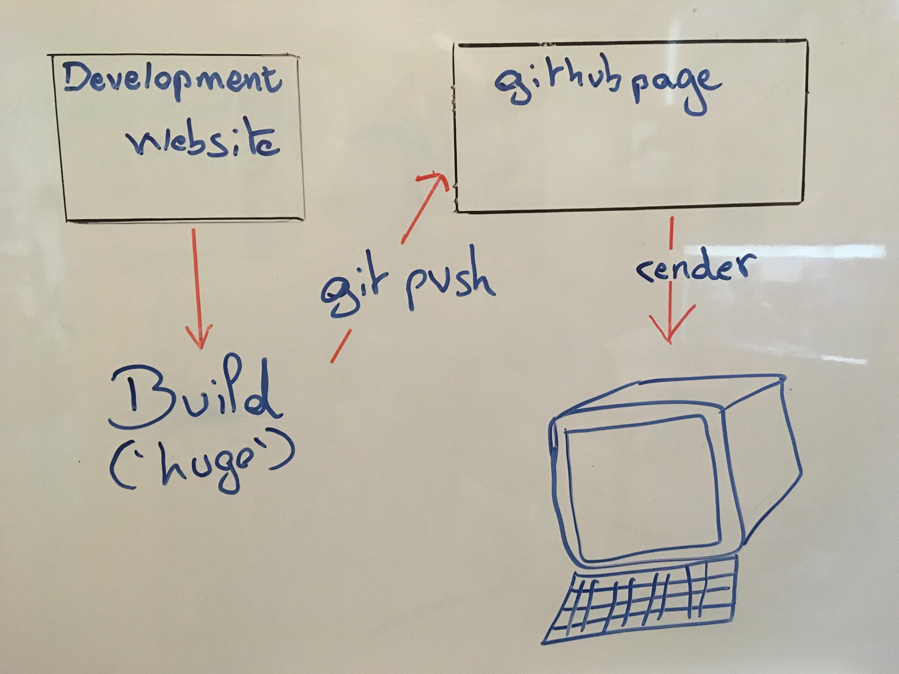

# Café DevOps Lyon

__summary__:
  - [Description](#description)
  - [Install](#Install)
  - [Use it](#use-it)
  - [Add meetup](#add-meetup)
  - [Add Speaker](add-speaker)
  - [References](#references)


## Description

  This Website is generated by `hugo`.This technologie is based on go.
  Two repo are used to manage and display the website.  

  *First repository ([CafeDevopsLyon/website](https://github.com/CafeDevopsLyon/website))*:  
  This repository is the development website, it is used to write code and test the render.

  *Second repository ([CafeDevopsLyon/cafedevopslyon.github.io](https://github.com/CafeDevopsLyon/cafedevopslyon.github.io))*:  
  This repository is the host of the website is based on a Github page system.

  


## Install

Install is requirer for local development and to build the website.

- *Linux*:  
  ```shell
  sudo pacman -Syu hugo
  # or
  sudo apt-get install hugo
  # or
  sudo dnf install hugo
  # or
  snap install hugo
  ```
- *Mac OSX*:  
  ```shell
  brew install hugo
  ```
- *Windows*:  
   It's more complex for windows, but you can follow the example provide by this video:
   [Install hugo for Windows](https://www.youtube.com/watch?v=G7umPCU-8xc)  

More details about the hugo install are available on [the official website](https://gohugo.io/getting-started/installing).


## Use it

*Run hugo server localy*:  
```shell
hugo server -D
```
*Build website to public folder*:  
```shell
hugo
```

*Deploy procedure*:
```shell
git add .  # or git add -p
git pull
# Resolve conflicts

git commit -m <commit-msg>
git push origin master


# Run deploy script
.deploy.sh
```

*Manual procedure to deploy*:
```shell
git add .  # or git add -p
git pull
# Resolve conflicts

git commit -m <commit-msg>
git push origin master

# Build the project.
hugo

# Copie de CNAME
cp CNAME public/

# Go To Public folder
cd public

# Add changes to git.
git add .
git commit -m "rebuilding site `date`"
git push origin master
```

## Add meetup

  First you have to create a file in `content/posts/<your_meetup_name>.md`:
  ```shell
  # Example:
  ➜ hugo new posts/Migration-de-6play-vers-le-Cloud_retour_dexperience.md
  /Users/kuty/Workspace/cafe_devops/website/content/posts/Migration-de-6play-vers-le-Cloud_retour_dexperience.md created
  ```
  then, you have to edit the file created (`content/posts/Migration-de-6play-vers-le-Cloud_retour_dexperience.md`):
  ```yaml
  ---
  title: "Migration-de-6play-vers-le-Cloud_retour_dexperience"
  date: 2019-09-16T12:30:01+02:00
  draft: true
  ---
  ```
  once edited:
  ```yaml
  ---
  title: "Migration de 6play vers le Cloud, retour d'expérience"
  date: 2019-09-16T14:00:00+02:00
  draft: true

  speakers:
    - Pascal Martin

  # The URL to the site on the internet.
  tags: ["Retour d'expérience", "Cloud"]
  ---

  ```
## Add Speaker

  Copy a speaker folder which already exist:
  ```
  # Example:
  ➜ cp -r content/speakers/mathieu-corbin content/speakers/pascal-martin
  ```
  then, edit the \_index.md in the new fodler:
  ```yaml
  ---
  name: "Pascal Martin"
  linkedin: "" # Linkedin link
  siteURL: "" # Personal links
  twitter: "" # @<pseudo>
  ---
  Content / description of the speaker.
  ```

## References

- [Cafedevops Website](https://cafedevops.org)
- [Github account](https://github.com/CafeDevopsLyon)
- [Hugo website](https://gohugo.io)
- [Hugo documentation](https://gohugo.io/documentation/)
- [Golang](https://golang.org)
